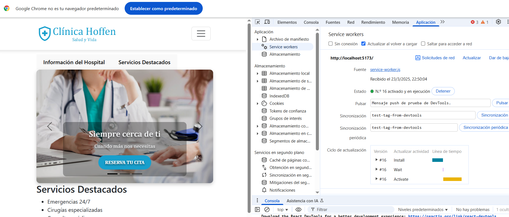
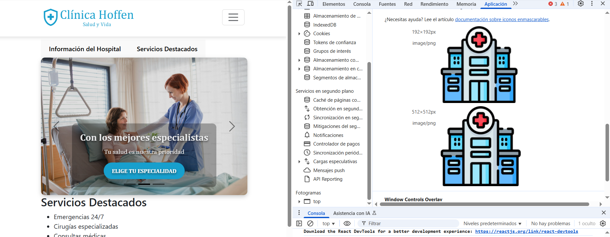

## INSTALACIÓN

<code>
git clone git@github.com:vpmlagos/m4-laboratorio-3.git
cd m4-l3-app  
npm install 
npm install react-router-dom 
npm install prop-types 
npm install bootstrap 
npm install bootstrap @popperjs/core 
npm install react-bootstrap-icons 
npm run dev 
</code>

## Mejorando performance con Profiler

### Mejoras al componente DateForm

Utilizaremos Profiler para identificar qué componente tarda en renderizarse. En el caso particular para la vista de Agendar cita. 

En este caso DateForm tardó cerca de 4ms totales relacionados en renderizar, lo que está lejos del resto de los componentes renderizados. 

En la segunda imagen se puede apreciar que el tiempo total relacionado pasó de 4ms a 2ms, mejorando el tiempo de renderización.

#### Cambios realizados

1. Validación reutilizable: <code>validateForm</code> fue centralizada para todo el código

2. Facilitación de TIME_SLOTS: Se reubicó para mejorar en un futuro su ajuste automático.
